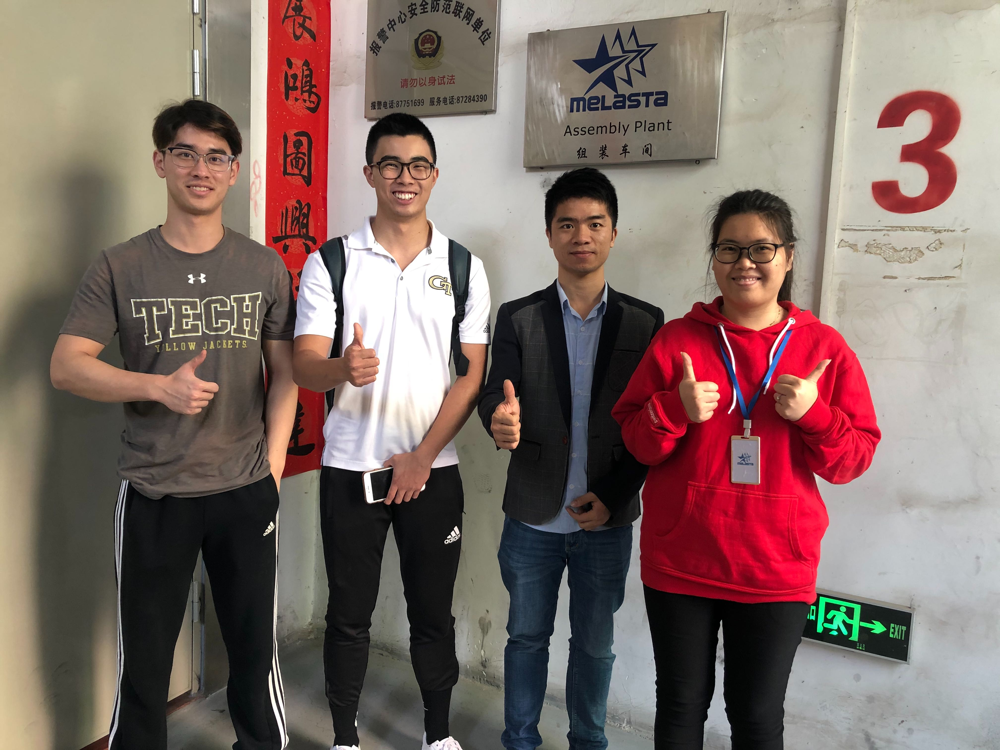

* 
 

###### On site negotiation for custom pouch cells in Dongguan, China.
* 
 

###### We were able to secure a deal for a small production run, where a custom electrode cutting die was required and a modification to their electrode stacking schedule.
* 
 

###### Battery cells imported using UPS courier service.
* 
 

###### Full cell characterization is performed (DCIR, Capacity, Impedance, GD&T) for very cell to ensure reliability.
