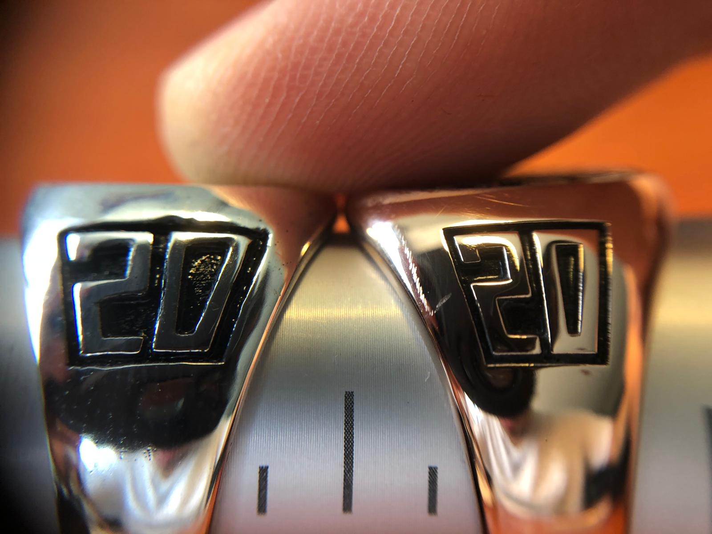
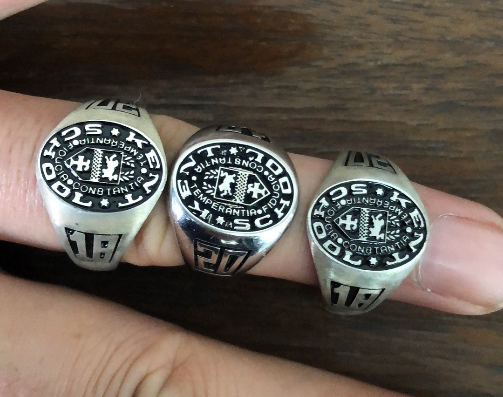

* 
###### A macro photo displaying the sides of two signet ring samples, one sand casted and the latter using a die cast.

* 
###### Three different signet rings with varying ring geometry. The intricate detail on the top surface is completed using a 3-axis CNC mill, however each with a engraving tool of differing angle (30,45,60)
