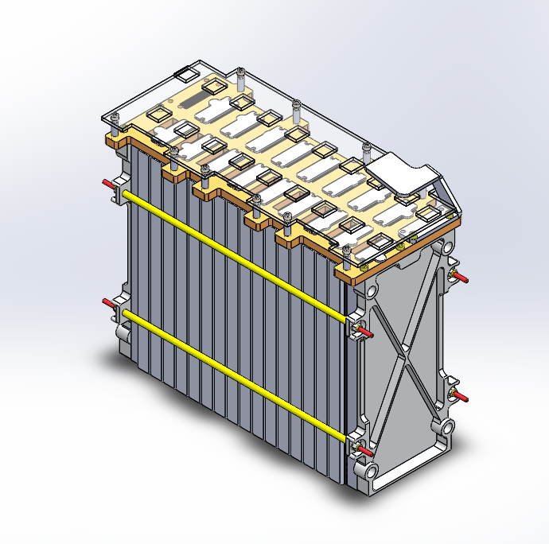
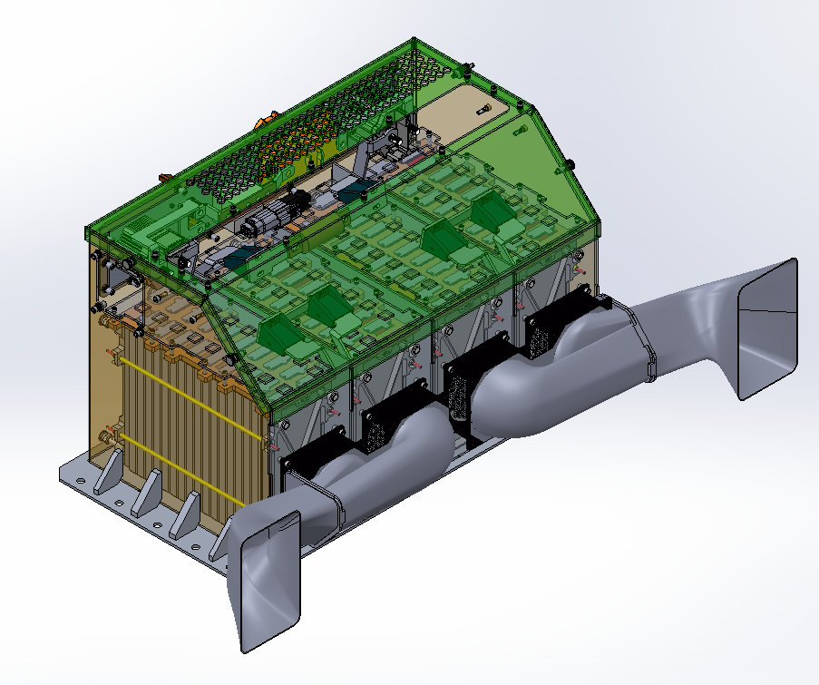
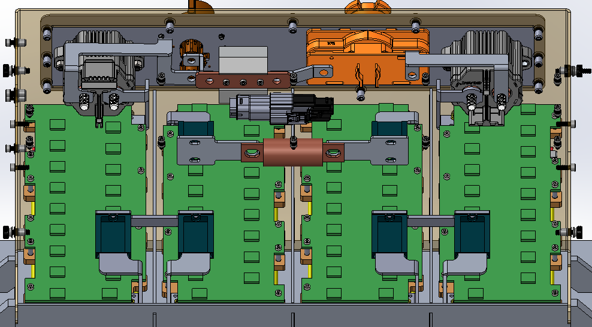

* 
 

###### Each battery segment contains 18 battery cells. The custom battery management system PCB board will be placed on top of the tab connections to monitor voltage and temperature.
* 
 

###### The full battery pack assembly. Four battery segments are placed in an specially designed aluminum container optimized to withstand the g-forces from a crash scenario. The ram air intake increases static pressure in the inlet.

* 
 

##### Specially manufactured aluminum 1100-O busbars are used, and various disconnects and HV contactors can be shown here as well. Our pack is fused at 175A.
