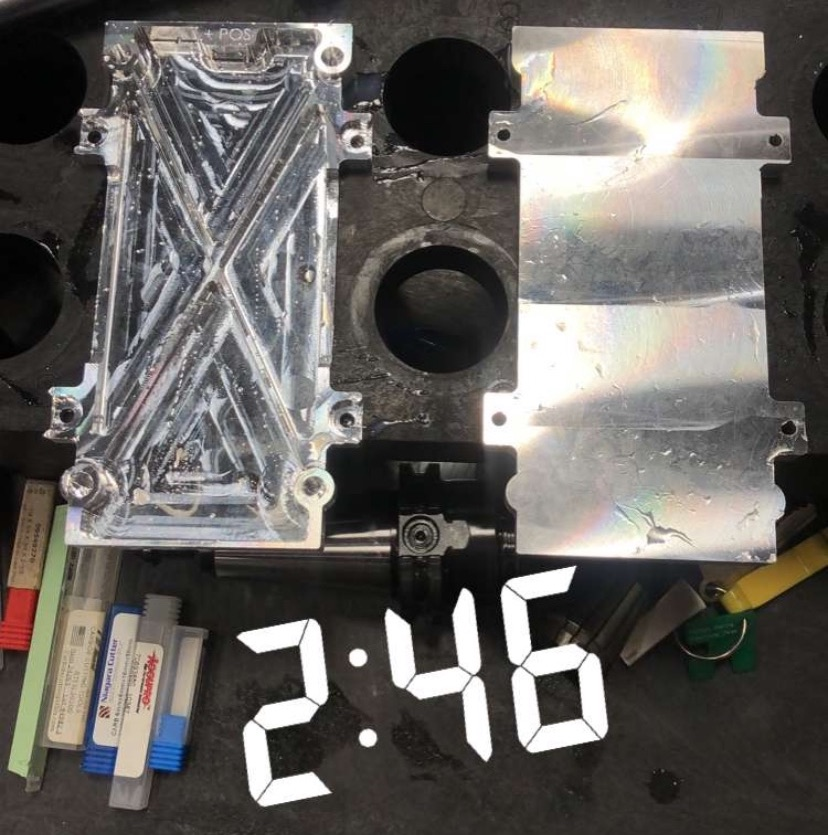

* 
###### We design our CAM pathways using HSMWorks and utilize tools donated by SECO. Shown here is our stock simulation for our third machining operation for the segment endplates.

* 

##### Here is a screenshot from my snapchat showing the finished endplate compared to the endplate with only two operations completed (abrasive waterjet, face). Machining takes an incredibly long time, especially the setup, so often times this results in all-nighters!
